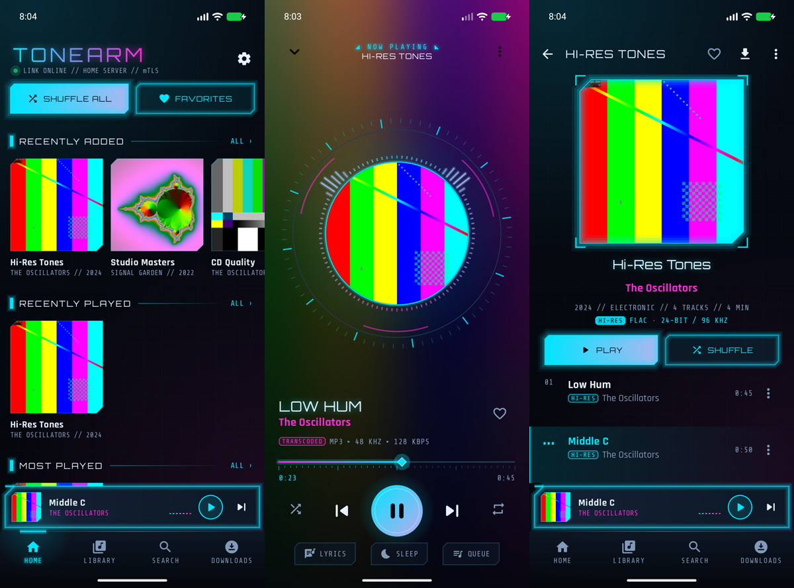
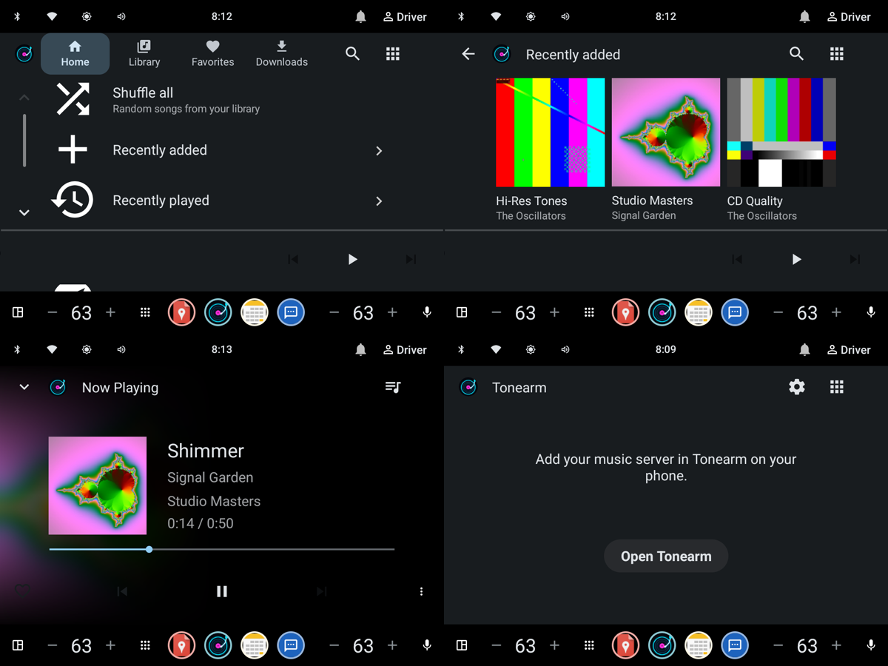
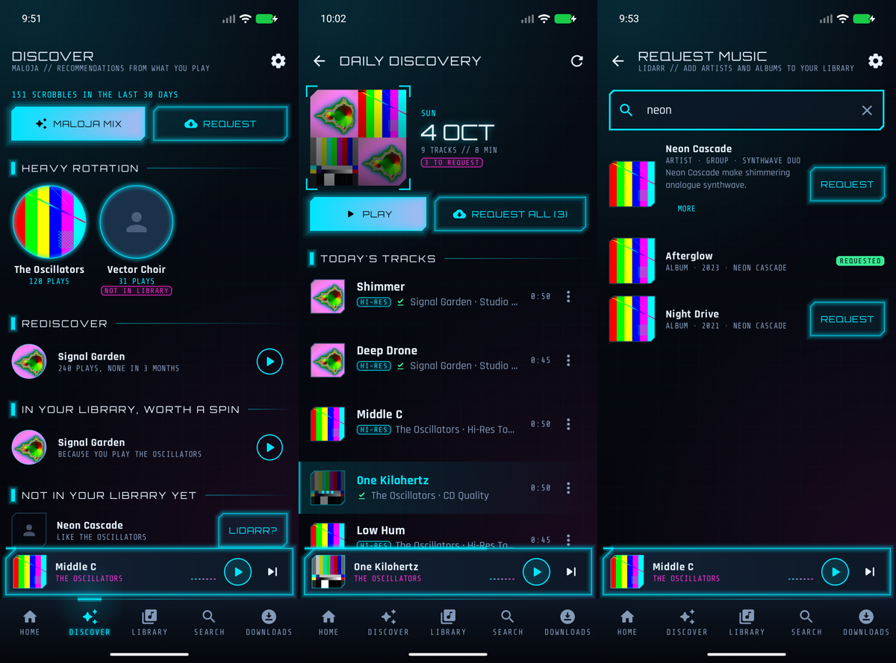

# Tonearm for Android

A lossless-first Android music player for **Subsonic / OpenSubsonic** servers (Navidrome, Gonic,
Airsonic-Advanced, LMS, …), with **mutual TLS** support so it works behind a reverse proxy that
requires client certificates, a neon sci-fi HUD design, Android Auto support, recommendations from
your **Maloja** scrobbles, music requests through **Lidarr**, AI picks from your own **Ollama** (through the Tonearm server), and
**YouTube Music** playback for anything you don't have yet (like a song there and its album gets requested in Lidarr).

Related repositories:

- [**Tonearm**](https://github.com/brab-one/Tonearm): start here, the short install and setup guide for everything
- [**Tonearm-Desktop**](https://github.com/brab-one/Tonearm-Desktop): the desktop app for Linux and
  Windows (native, not a web app) with the same server support and a Lidarr dashboard
- [**Tonearm-Server**](https://github.com/brab-one/Tonearm-Server): for everyone on your Navidrome: Tonearm
  Connect (this app controls the desktop player and moves playback between the two), Lidarr and Maloja
  without handing out their keys, and AI picks from your Ollama
- [**Tonearm-Connect**](https://github.com/brab-one/Tonearm-Connect): the same as a Lidarr plugin, used when
  there's no Tonearm server







## Features

**Design**
- Neon HUD theme: near-black grid backdrop, chamfered panels, glowing accents, Orbitron / Rajdhani / Share Tech Mono type
- Now Playing "reactor": round cover in a rotating tick ring with a live spectrum radiating around it and a play button that pulses with the bass
- Real-time visualizer fed from the decoded audio (works with 24-bit/hi-res float output, needs no microphone permission), also in the mini player
- Accent colors: plasma cyan, synth magenta, reactor amber, terminal green, ion violet, or taken live from the album art

**Playback**
- Bit-perfect FLAC streaming (`format=raw`), 32-bit float output for 24-bit/hi-res files
- Gapless playback, background playback, media notification, lock screen, Bluetooth/headset buttons
- Shows what's actually decoded: codec, bit depth, sample rate, bitrate, HI-RES / LOSSLESS / TRANSCODED / OFFLINE badges
- Per-network quality: original on Wi-Fi, optional MP3/Opus/AAC transcoding on mobile data
- ReplayGain (track/album, pre-amp, clipping protection), built-in equalizer + system EQ apps
- Sleep timer (with fade-out, or "end of this song"), optional audio offload for battery
- Queue with drag-to-reorder, play next, add to queue; the queue survives restarts
- Synced lyrics (OpenSubsonic `songLyrics`) with tap-to-seek, plain lyrics fallback
- Scrobbling (now playing + submissions, retried when offline)
- Android Auto browsing, voice search ("play … on Tonearm"), playback resumption
- **When the queue ends**: stop, keep going with similar music (library first, then YouTube Music's radio
  for the last song), or play another of your playlists
- Seeking works even behind proxies that drop range requests: the file size from the server fills in

**Library**
- Home: recently added / played, most played, liked, discover, shuffle all
- Artists (A–Z), albums (7 sort orders, endless scrolling), playlists, genres, liked
- Album, artist (bio, popular songs, similar artists), playlist and genre pages; search
- **Like** button everywhere (mini player, Now Playing, song menus, the notification and the car). Liking a
  YouTube Music song requests its album in Lidarr (never the whole discography) and likes it on the server
  once it's downloaded; until then it waits under Library → Liked. These likes are shared with the desktop app
  through Tonearm Connect (the Tonearm server, or the Lidarr plugin 1.1+), and songs from outside the library show whether they're in your
  library already, downloading in Lidarr or requested there
- **YouTube Music artists and albums**: search and artist pages show artists' bios, popular songs and the albums
  you don't have, playable from YouTube Music, with "Request album"
- Playlist management: create, rename, delete, add and remove songs
- **This phone** (Library tab): music files stored on the phone, by album, in search, liked songs and Android Auto
  ("On this phone" under Library). They play straight from storage, next to the server's library
- Instant mix from any song (needs similar-song data on the server)

**Discover (Maloja + Lidarr)**
- Recommendations from your Maloja listening history: heavy rotation, favourites you haven't played in months,
  similar artists in your library you rarely play, and similar artists you don't have yet
- **Daily Discovery**: a fresh ~30-song mix every day (also kept as a "Daily Discovery" playlist on your server,
  so Android Auto and other apps can play it), plus the day's recommended artists you don't own,
  with **Request all** to send them all to Lidarr (latest album, all albums, or artist only)
- Maloja mix (in Android Auto): songs similar to what you've been playing, minus what you played recently
- Request any artist or album through Lidarr from search, recommendations or the Request screen,
  and follow Lidarr's download queue
- **AI picks** (with the Tonearm server and Ollama): albums by artists you don't have, from what you play
  and like, under Discover; tap one to open it on YouTube Music, or request it
- **Weekly picks** (in the AI picks panel): every week the first few AI picks are downloaded by Lidarr and arrive
  as a "Weekly picks" playlist. A week later the playlist and its music are deleted again, except albums with a
  song you liked or put in another playlist; like the playlist itself (and name it) to keep all of it
- Optional direct scrobbling to Maloja; all integrations can reuse the music server's mTLS client certificate

**Offline**
- Download songs, albums and playlists in original quality (Wi-Fi only by default)
- Downloaded songs play from the device, with cover art, even with no connection
- Downloads upgrade themselves: when the server gets a better file for a downloaded song (FLAC where it was
  MP3/AAC, or hi-res where it was CD quality, e.g. after Lidarr upgraded it), the phone downloads the new one.
  "Download" on a YouTube Music song saves your library's own file once Lidarr has it
- The next songs in the queue play from your library's file as soon as it has one: a YouTube Music song switches
  to the FLAC Lidarr downloaded, and a song whose file was upgraded isn't served from the old cached copy
- 2 GB streaming cache (configurable) so replays don't hit the network
- Cache ahead: the next 3 songs of the queue (configurable up to the whole queue, shuffle-aware) are cached
  while one plays, so skips are instant and a dead spot in the car doesn't stop the music

**Servers & security**
- Multiple servers; token, legacy (hex password) or API-key login
- **mTLS client certificate** from an imported `.p12`/`.pfx` file, or from Android's credential storage
- Private CA import, or trust-on-first-use with SHA-256 fingerprint for self-signed servers
- Passwords and `.p12` passwords encrypted with an Android Keystore key; no backups of secrets

## Building

Already installed on this machine: JDK 21, the Android SDK in `~/Android/Sdk` (platform 37,
build-tools, command-line tools) and the Gradle wrapper.

```bash
./gradlew assembleRelease        # app/build/outputs/apk/release/app-release.apk (signed, ~3 MB)
./gradlew assembleDebug          # installs side by side as "io.github.deadeyebarb.tonearm.debug"
./gradlew testDebugUnitTest lintDebug
```

Install on a phone with USB debugging enabled:

```bash
adb install -r app/build/outputs/apk/release/app-release.apk
```

The release signing key is `~/.android/keystores/tonearm-release.jks`; its password is in
`keystore.properties` (git-ignored). **Back both up**: Android only installs updates signed with
the same key.

## Setting up mTLS

### 1. Make a client certificate

If you already have a CA for your proxy, sign a client cert with it. Otherwise:

```bash
# A private CA (keep ca.key safe)
openssl req -x509 -newkey rsa:4096 -nodes -days 3650 -subj "/CN=My Music CA" \
  -keyout ca.key -out ca.crt -addext "basicConstraints=critical,CA:TRUE"

# A client key + certificate signed by it
openssl req -newkey ec -pkeyopt ec_paramgen_curve:P-256 -nodes -subj "/CN=my-phone" \
  -keyout phone.key -out phone.csr
echo "extendedKeyUsage=clientAuth" > client.ext
openssl x509 -req -in phone.csr -CA ca.crt -CAkey ca.key -CAcreateserial -days 825 \
  -extfile client.ext -out phone.crt

# Bundle for the phone (you'll type this password once in the app)
openssl pkcs12 -export -inkey phone.key -in phone.crt -certfile ca.crt -name my-phone -out phone.p12
```

Both the OpenSSL 3 default encoding and `-legacy` were tested on Android 16. If an older Android
version refuses the file, re-export it with `-legacy`.

### 2. Require it on the server

nginx in front of Navidrome:

```nginx
server {
    listen 443 ssl;
    server_name music.example.com;
    ssl_certificate     /etc/letsencrypt/live/music.example.com/fullchain.pem;
    ssl_certificate_key /etc/letsencrypt/live/music.example.com/privkey.pem;

    ssl_client_certificate /etc/nginx/music-ca.crt;   # the CA that signed phone.crt
    ssl_verify_client on;

    location / {
        proxy_pass http://127.0.0.1:4533;
        proxy_set_header Host $host;
        proxy_set_header X-Forwarded-For $proxy_add_x_forwarded_for;
        proxy_set_header X-Forwarded-Proto $scheme;
        proxy_buffering off;   # smoother streaming and seeking
    }
}
```

Caddy: `tls { client_auth { mode require_and_verify; trust_pool file /etc/caddy/music-ca.crt } }`.

### 3. Add it in the app

Copy `phone.p12` to the phone, then in **Add server** → **Client certificate (mTLS)**:

- **Import .p12 file**: pick the file and enter its password. The app keeps a private copy, so you
  can delete the original. Or:
- **Use installed**: install the `.p12` in *Settings → Security → Encryption & credentials → Install
  a certificate → VPN & app user certificate*, then choose it. The key stays in Android's secure
  storage.

Then **Test connection**. If your server uses a private CA or a self-signed certificate, the app
shows the certificate's SHA-256 fingerprint and offers to trust it for this server only (check it
against `openssl x509 -noout -fingerprint -sha256 -in cert.pem`), or import the CA with **Import CA
certificate**.

The certificate is used for every request: API calls, streaming, cover art, downloads, and the
artwork shown in the notification and Android Auto.

## Maloja and Lidarr

Open **Settings → Integrations** (or the **Discover** tab).

With the [Tonearm server](https://github.com/brab-one/Tonearm-Server) holding Lidarr's and Maloja's keys,
there's nothing to enter: both come through it with your music server login, and the settings say so (what
you enter there is only used without the server). Through it, Navidrome admins get all of Lidarr; everyone
else can request music and see downloads.

**Maloja** needs its address and an API key (Maloja → Settings → API keys; reading charts works
without one, sending plays needs it). Turn on *Send plays to Maloja* only if your music server doesn't
already forward scrobbles there, or every play is counted twice. Similar-artist suggestions come from
your music server: in Navidrome set a Last.fm API key (`ND_LASTFM_APIKEY`) so “similar” and “not in
your library” lists aren't empty.

**Lidarr** needs its address and API key (Lidarr → Settings → General). *Test & load profiles* reads
your root folders, quality and metadata profiles; leave them on “default” to use the root folder's
defaults. Requests add the artist (or one album) with those settings and, if enabled, start searching.

If Maloja or Lidarr sit behind the same mTLS proxy as your music server, leave *Use the music server's
client certificate* on (the default). Requests then use the same client certificate and trusted CA as the
music server, in the background daily job too. Errors from these services start with “Maloja:” or
“Lidarr:”, so you can tell them apart from music server errors.

With an empty library (a fresh Navidrome answers “Library not found or empty”), Discover says so
instead of failing, and Daily Discovery offers the artists from your Maloja history under
*Request all* until Lidarr has fetched some music.

**AI picks** come from the [Tonearm server](https://github.com/brab-one/Tonearm-Server) when it has Ollama:
albums by artists you don't have, from what you play and like on the music server, checked against
Lidarr so made-up albums are dropped. They're renewed every week or when you tap **Ask again**; on the
desktop, **More like this** asks for ones like a song, album, artist or playlist. With **Weekly picks** on
(Navidrome admins), the first 3, 5 or 10 are requested every week; phone and desktop share that setting.

**Daily Discovery** is rebuilt once a day (in the background too, via WorkManager) and stays the same
for the rest of the day; the ⟳ button rebuilds it on demand. The server-side “Daily Discovery” playlist
is overwritten each day, so don't add your own songs to it.

## YouTube Music fallback

Things you don't have can still be played: the ▶ buttons on Discover's "not in your library" rows
and heavy-rotation artists you don't have, Daily Discovery's missing artists, AI picks (tap one to open it), the **On YouTube Music** section of Search, and "play … on Tonearm" in the car when the library has
no match. They stream from YouTube Music (Opus, up to 160 kbps; Now Playing shows a YOUTUBE MUSIC tag)
in the same queue as library songs, with the visualizer, cache-ahead and Maloja scrobbling (if on).

Playing a song requests nothing. **Liking** one asks Lidarr for the album it's on (the one YouTube Music
names, else found in Lidarr's own track lists for the artist, studio albums first; the app doesn't contact
MusicBrainz itself), so the lossless version lands on your server; once it's there the song
is liked in your library. If its album can't be found, nothing is requested. Turn this off under
**Settings → YouTube Music → Request songs you like**.

This uses [NewPipeExtractor](https://github.com/TeamNewPipe/NewPipeExtractor), the library behind
NewPipe, without a Google account. It's unofficial: YouTube's terms don't allow third-party players,
and changes on YouTube's side can break it until the library catches up. YouTube Music songs can't be
downloaded, added to server playlists or show lyrics.

## Tonearm Connect (phone ↔ desktop)

With the [Tonearm server](https://github.com/brab-one/Tonearm-Server) next to your Navidrome (at
`<music server>/connect-tonearm/`, found by itself; it serves every user with their own login), or else the
[Tonearm Connect](https://github.com/brab-one/Tonearm-Connect) plugin in your Lidarr, the **Devices** screen (the devices icon on Home
and in Now Playing) lists the [desktop players](https://github.com/brab-one/Tonearm-Desktop) and turns the
phone into their remote: what's playing, seek, play/pause, skip, shuffle, repeat, volume and the queue
(tap to jump). **Play this phone's music there** hands your queue and position to the desktop and pauses
the phone; **Continue on this phone** does the reverse. Both apps should use the same music server
address, since song ids are per server; the phone warns when they don't.

## Android Auto

Tonearm shows up in Android Auto (and in cars running Android Automotive) with four tabs:
**Home** (Daily Discovery, Maloja mix, shuffle all, recently added/played, most played, random picks), **Library** (artists, albums,
playlists, genres), **Favorites** and **Downloads**. Albums show as cover grids, picking a song plays
its album or playlist from there, search and voice ("play … on Tonearm") work, and the player has
favorite / shuffle / repeat buttons. Streaming, mTLS and downloads all run on the phone as usual.

**Because Tonearm isn't installed from the Play Store, Android Auto hides it until you allow it once:**

1. On the phone open *Settings → Connected devices → Connection preferences → Android Auto*
   (or the Android Auto app).
2. Scroll down and tap **Version** ten times, confirm, to unlock developer settings.
3. In the ⋮ menu choose **Developer settings** and turn on **Unknown sources**.
4. Reconnect to the car. Tonearm appears in the media app list.

If no server is set up yet, the car shows "Add your music server in Tonearm on your phone" with an
**Open Tonearm** button.

To try it on the computer with the Desktop Head Unit (installed in
`~/Android/Sdk/extras/google/auto/`): in Android Auto's developer settings pick
**Start head unit server**, connect the phone over USB, then run

```bash
adb forward tcp:5277 tcp:5277
```

```bash
~/Android/Sdk/extras/google/auto/desktop-head-unit
```

For Android Automotive OS the playback service opts into the car's media UI with the
`androidx.car.app.launchable` flag, so it appears there even though the app also has its own
setup screen. The `Tonearm_Car` emulator (Android Automotive 15) was used to test all of this.

## Test server

`tools/mock-subsonic/server.py` is a small Subsonic/OpenSubsonic server (Python standard library,
plus `openssl` and `ffmpeg` to generate fixtures) that requires a client certificate:

```bash
python3 tools/mock-subsonic/server.py            # https://0.0.0.0:8443, user demo / password demo
python3 tools/mock-subsonic/server.py --no-mtls  # TLS without client auth
python3 tools/mock-subsonic/server.py --empty-library  # no music, like a fresh server
python3 tools/mock-subsonic/server.py --brainarr-untagged  # Brainarr list without a tag yet
# in front of a Tonearm server, like the proxy (run the server with NAVIDROME_URL=http://127.0.0.1:8444)
python3 tools/mock-subsonic/server.py --connect http://127.0.0.1:8790 --plain-port 8444
```

On first run it creates a CA, a server certificate valid for `localhost`, `127.0.0.1` and
`10.0.2.2` (the host as seen from the Android emulator), client certificates
(`client.p12` and `client-legacy.p12`, password `tonearm`), and albums of 16/44.1, 24/96 and
24/192 FLAC tones with cover art and synced lyrics, all under `tools/mock-subsonic/data/`.
The same address also serves a mock **Maloja** (`/apis/mlj_1/`, API key `maloja-key`) with a listening
history, and a mock **Lidarr** (`/api/v1/`, API key `lidarr-key`) with a small catalog, a download
queue, album lookups and track lists, so Discover, Daily Discovery, requests and (behind a Tonearm server)
weekly picks can be tried end to end.

## Architecture

`shared/` is plain Kotlin/JVM code that both this app and
[Tonearm-Desktop](https://github.com/brab-one/Tonearm-Desktop) compile (the desktop repository includes
this one as a submodule): the Subsonic client and models, TLS, the Lidarr/Maloja clients, the
Connect protocol (with the Tonearm server's AI picks), weekly picks and YouTube Music. `app/` is the Android app.

```
ui/          Jetpack Compose (Material 3) screens, one LoaderViewModel per screen; ui/theme holds
             the HUD design system (palette, fonts, chamfered shapes, glow/bracket modifiers)
playback/    PlaybackService (Media3 MediaLibraryService + ExoPlayer), Android Auto tree,
             queue persistence, scrobbler, cache-ahead, ReplayGain, sleep timer, equalizer,
             SpectrumAnalyzer (FFT of decoded PCM via a wrapping AudioSink, for the visualizer)
media/       Two-level cache data source: download cache → LRU stream cache → SubsonicDataSource
download/    Media3 DownloadManager + foreground DownloadService
subsonic/    REST client, models, sessions (one TLS-configured OkHttp client per server)
net/         mTLS key managers, trust managers, PKCS#12/PEM handling
data/        DataStore-backed settings, server list and integrations, Keystore-encrypted secrets
integrations/ Maloja and Lidarr clients, Recommender, DailyDiscovery (+ daily WorkManager job),
             weekly picks job, AutoRequest (requests what plays from YouTube Music)
youtube/     YouTube Music search and audio resolution (NewPipeExtractor over OkHttp)
```

Playback URIs look like `tonearm://song/<server>/<song>` and never contain credentials. They're
resolved into authenticated stream URLs only when the player opens them, through the owning
server's OkHttp client, which carries the client certificate. YouTube Music songs use the
pseudo-server `ytmusic` and their video id (`tonearm://song/ytmusic/<id>`); their audio URL is
resolved at open time too, and fetched with the User-Agent of the YouTube client it was issued for.

## Known limitations

- Android Auto was tested through Android Automotive OS (same media-browser interface, car media UI);
  the phone-projection path with the Desktop Head Unit needs a phone with the full Android Auto app.
- "Use installed" (Android credential storage) wasn't exercised in testing; the imported-`.p12`
  path was, end to end.
- No crossfade (ExoPlayer doesn't support it); gapless playback is supported.
- "Play next" while shuffle is on adds the song after the current one in list order, not
  necessarily as the next song played.
- Changing *Hi-res output* takes effect the next time the player starts.
- The YouTube Music fallback depends on NewPipeExtractor keeping up with YouTube (see above).
- Tonearm Connect needs the Tonearm server or the plugin in Lidarr; a device that quits uncleanly is listed as offline
  (with when it was last seen) until it's back.
- AI picks are only as good as the model; a small one on an iGPU takes a few minutes and sometimes repeats
  itself (made-up albums are dropped when Lidarr's metadata search answers).
